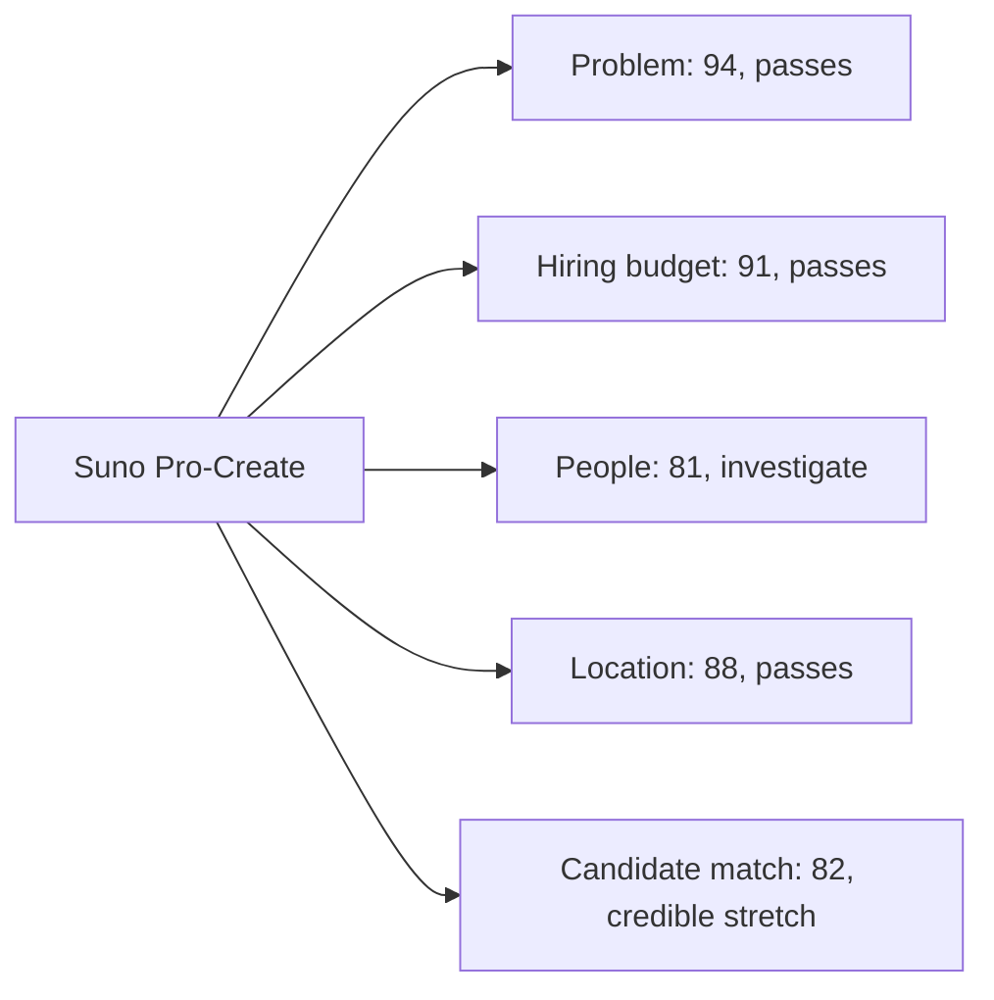

# Suno role assessment

Checked 2026-08-29 against Suno's official Ashby feed, current company pages,
current Studio 2.0 materials, public team evidence, Adam's canonical profile,
and the local Strummer workspaces.

## Verdict

Campaign only for [Software Engineer, Fullstack, Pro-Create](https://jobs.ashbyhq.com/suno/f8fd9d3e-4ef7-471a-9205-9f7ca5c36c81).

This is Adam's most personally aligned product-engineering investigation so far,
but it is not currently an S-tier workplace. The role clears problem, budget,
and location. People falls to 81 because the current posting explicitly says
the work demands intensity, the exact team lead describes repeated late nights,
and recent company-wide employee reports add concerns about management layers,
trust, morale, autonomy, and career growth. Candidate match is a credible stretch,
not a near-match: Adam has approximately 28 to 29 supportable months of paid
engineering work against a 4-year floor, his strongest DAW evidence is local and
uncommitted rather than public, and no production-scale or Suno-use evidence is
currently approved.

Do not spray the other 61 openings.

## Live application finding

A read-only Helium inspection on 2026-08-29 confirmed that the application is
live and contains one required essay plus three unusually relevant screens:

- Full-stack experience offers `0-1`, `1-2`, or `3+`. Adam's profile currently
  records `2-3 years`, so exact dates are required before choosing.
- Audio-software experience includes `I have built audio-related software`,
  which is supportable only after Adam approves the exact Strummer claim.
- AI workflow fluency includes `Complete Delegation to Autonomous AI with
  Quality Controls`, which closely matches Adam's verified agent and evaluation
  evidence.
- `Why are you interested in working at Suno?` is required.
- The form requires explicit acceptance of Monday-to-Friday office work.

Nothing was filled, uploaded, or submitted. The form's invisible reCAPTCHA and
final submission remain Adam-only actions.

## S-tier gate

| Axis | Score | Evidence | Binding gap |
| --- | ---: | --- | --- |
| Problem | 94 | The role owns Suno Studio, an active browser-based generative audio workstation. Studio 2.0 added MIDI, a chat collaborator, plugin design, and MIDI-conditioned audio generation in August 2026. | Adam must confirm that Suno's current copyright and licensing transition is ethically acceptable to him. |
| Hiring budget | 91 | Live approved role, $188,640 to $247,590 base, target equity, health benefits, retirement match, and a company-reported $400M+ Series D at a $5.4B post-money valuation. | Exact equity, relocation support, hiring speed, and trial policy are unknown. |
| People | 81 | Sam Watkinson, WavTool co-founder and Pro-Create lead, publicly says he leads the team and is hiring. Current engineer Andrew Mohn calls Suno the best job and team of his life, and the acquired WavTool team remains in leadership. Counterevidence is now material: the live posting says the work demands intensity, Sam describes a later push as `week after week, late night after late night`, and current anonymous reviews report management layers, low trust, low morale, limited autonomy, and weak career growth. | No evidence yet shows how the direct manager coaches and develops engineers, whether repeated late nights are exceptional, or whether the Pro-Create team is insulated from the company-wide concerns. |
| Location | 88 | Official feed says onsite San Francisco. Adam is a US citizen, requires no US sponsorship, and is recorded as open to worldwide relocation. The listed salary can support meaningful savings after San Francisco costs if the offer lands inside the band. | Adam must confirm San Francisco and five-day office work. Relocation support is unknown. |

**Target quality: 81. Status: `investigate`.** Target quality is the weakest
axis, not an average.

### People-axis re-audit

- Attribution correction: Sam Watkinson, not Andrew Mohn, authored the post
  saying the Professional Creation team still keeps evenings, weekends, and
  sleep. Sam also says he leads the team and explicitly opens his DMs.
- Andrew supplies independent current-employee evidence by calling Suno the
  best job and team of his life.
- Suno's acquisition announcement says WavTool's core team joined in product
  and engineering leadership. Keith Chia and other former WavTool colleagues
  publicly describe the group and Sam in unusually positive terms.
- Sam's earlier recommendation for Keith gives one concrete trust signal: at
  Zeus, Sam says Keith called the shots on virtually all frontend engineering,
  including architecture, practices, and the most important UI work. Keith now
  works with Sam at Suno. This supports a pattern of delegating meaningful
  ownership, but it is older evidence from another company and does not prove
  current coaching at Suno.
- Counter-signal: Sam later described the v5.5 push as `week after week, late
  night after late night`. That may describe an exceptional launch, but it is
  direct enough that sustainable hours cannot be assumed.
- Current role signal: Suno now tells applicants that the pace is fast and the
  work demands ownership and intensity. It also requires five office days and
  says applicants should iterate rapidly and work hard.
- Company-wide counterevidence: 12 current Glassdoor reviews produce a 3.8
  overall rating, 74 percent recommendation rate, 3.8 work-life score, 3.3
  culture score, and 3.4 career-opportunity score. Recent reviewers report
  unclear ownership from added management layers, low trust and morale, and a
  controlled, politically driven environment. Other reviewers report high
  autonomy, strong music culture, smart people, and very high trust. These are
  anonymous and not exact-team proof, but the pattern is mixed enough to matter.
- Decision: lower People to 81. The named lead, team continuity, and independent
  peer evidence prevent rejection. The exact-team late-night account, explicit
  intensity language, and recent company-wide concerns prevent an 84. A current
  coaching example, normal-hours account, launch recovery policy, and direct
  Pro-Create employee calibration are required before this can rise.

## Candidate match

**Candidate match: 82. Access strength: 94.**

The previous score of 90 over-weighted the unusually direct product overlap and
under-weighted the verified experience, adoption, and public-proof gaps. An 82
preserves the real upside without implying that the application clears the role's
seniority screen on evidence already in hand.

### Direct matches

- TypeScript, React, CSS, and full-stack product work are the role's primary stack.
- Adam's strongest public positioning is a full-stack TypeScript engineer who
  ships AI agent tooling end to end.
- The local `strummer-daw` workspace is a customized openDAW derivative with a
  human-approved music-factory MCP, chord MIDI compilation, audio generation,
  bounded previews, provenance records, stem separation, and Ableton session
  scaffolding.
- A fresh `npm run factory:verify` on 2026-08-29 passed 31 of 31 tests, exposed
  20 MCP tools, indexed 99 local sounds and 84 song specs, and verified six
  generated assets including chord-conditioned and exact-prefix extension paths.
- The system refuses to release an Ableton plan before one-time human approval,
  which is a useful product principle for an AI-native professional creation tool.
- Sam Watkinson is the named team lead, openly hiring, and explicitly invites
  direct messages. Andrew Mohn supplies independent current-employee evidence
  that this is the best job and team of his life.

### Honest gaps

- Supportable non-overlapping paid-engineering experience is approximately 28 to
  29 months. The posting asks for 4+ years.
- No approved evidence shows deep DSP or JUCE experience. These are listed as a
  plus rather than a requirement.
- The Strummer music-factory layer is local, has 24 dirty-worktree entries, and
  is not present on the public fork's current remote HEAD. Do not call it shipped,
  deployed, open source, or a public contribution yet.
- Much of the underlying DAW is openDAW. Describe Adam's work as a customized
  derivative and name the original project. Do not imply sole authorship.
- No specific Suno or Suno Studio usage is confirmed in Adam's canonical profile.
  Interest in music and local tooling does not prove product use.
- No university degree. The role accepts equivalent experience, so this is not a
  hard rejection, but the evidence must do more work.

## Board triage

Suno's official feed contained 62 listed openings, including 18 in Engineering.

| Role | Decision | Why |
| --- | --- | --- |
| Fullstack, Pro-Create, San Francisco | `campaign` after Adam confirms the five gates below | Exact product, stack, music, and local proof overlap. The experience gap is one level, not a different profession. |
| Software Engineer, Growth Marketing, NYC | `backup only` | The 3+ year floor and $200K to $250K band are plausible, but the role requires hands-on SEO, CRO, CMS, attribution, SQL, and lifecycle tooling evidence that is not yet in the canonical profile. It is farther from Adam's dream problem. |
| Senior or Staff Software Engineer, AI Engineering, Boston | `do not apply now` | Direct agent-loop, MCP, evaluation, and internal tooling overlap, plus an explicit invitation to imperfect applicants. The 5 to 7+ year senior floor, five-day Boston office, and missing published salary make it a weaker use of the same proof. |
| Software Engineer, Growth, NYC | `reject` | 5+ years or equivalent, consumer growth depth, experimentation, and data strategy are not the strongest evidence path. |
| Staff or Senior Product and Platform roles | `reject` | 5 to 7+ years, production scale, mentorship, and senior technical leadership are explicit. |
| Mobile, security, data science, ML research, management, and non-engineering roles | `reject` | They require specializations or leadership history absent from the verified profile. |

### Growth Marketing recheck

**Candidate match: 72. Decision: do not open a second Suno campaign.**

The official feed still lists 62 roles, including 18 in Engineering, and the
Growth Marketing role remains live at $200,000 to $250,000 plus equity. Its
3-year floor is closer to Adam's approximately 28 to 29 supportable months than
Pro-Create's 4-year floor, but the rest of the requirement set is materially
weaker:

- supported overlap: full-stack TypeScript delivery, frontend-leaning product
  work, AI tooling beyond code, founder-led sales and delivery, and communication
  with nontechnical stakeholders;
- partial evidence only: the repository has metadata, a sitemap, and Vercel
  Analytics code, but the analytics endpoint is not live and there are no
  approved conversion, funnel, SEO, attribution, or lifecycle outcomes;
- unsupported requirements: hands-on CRO, a marketer-operated CMS, marketing
  attribution platforms, lifecycle or CRM journeys, production SQL ownership,
  and end-to-end web and mobile funnel instrumentation.

This is not a gap that a tailored paragraph can close. It requires real
instrumented growth work with measured outcomes. Pro-Create therefore remains
the only justified Suno application, and it remains a prepared reserve rather
than an active S-tier target.

## Why the role is timely

- Suno launched Studio 2.0 on 2026-08-13 with MIDI import, recording, editing,
  a wavetable synth, MIDI-conditioned generation, and a chat collaborator.
- Suno acquired WavTool's browser DAW and core team in 2025, then placed that
  team into product and engineering leadership.
- The Pro-Create role was listed on 2026-04-04 and remains live. Its work is at
  the product's core rather than a peripheral internal function.
- Suno reported $400M+ in new capital at a $5.4B post-money valuation on
  2026-06-03.

## Important company risk

Suno is moving toward licensed models through Warner Music Group and BMG
partnerships, and its August 2026 principles describe artist collaboration,
opt-in participation, attribution, and safeguards. That transition does not
erase the live copyright risk. Major-label litigation was still active in
August 2026, and a court recently allowed an additional DMCA theory to proceed.

This is not a footnote. Adam should only pursue the role if he is comfortable
working inside that transition and can explain his view without pretending the
issue is settled.

## Proof-first win mechanism

Do not lead with a generic resume or a claim that Adam loves music. Lead with a
small, public-safe proof called `Human-approved song session`:

1. Show one song spec moving from incomplete creative decisions to an approved
   production kit.
2. Show the human approval gate before the Ableton plan is released.
3. Show chord symbols compiling into editable MIDI and a bounded audio preview.
4. Show the verification receipt, including 31 of 31 tests and path and batch
   safety constraints.
5. Credit openDAW, Stable Audio, AbletonMCP, Demucs, and Splice correctly.
6. Exclude local file paths, proprietary sample audio, credentials, and any
   unlicensed asset.

The product hypothesis is narrow: Studio 2.0 gives creators powerful generation
and editing primitives, but a session could also help the songwriter preserve
intent, expose unfinished creative decisions, and require explicit human choice
before automation changes the arrangement. Present this as a hypothesis, not as
an assertion about Suno's private roadmap or user research.

### Local artifact status

The proof now exists locally at
`/proof/suno-human-approved-song-session`. It is a static, `noindex` route and
has not been deployed or sent.

- The page uses only a synthetic song brief, synthetic asset names, and abstract
  note data. It exposes no local paths, credentials, proprietary audio, or
  licensed samples.
- The interaction keeps the arrangement locked until one candidate is chosen
  for each of four roles and the human approves that exact selection.
- The released plan contains five editable arrangement moves and a provenance
  receipt that clearly describes Adam's local Strummer workflow, not Suno's
  systems.
- The page shows editable chord-to-MIDI notes and bounded candidate selection.
  It does not play or generate audio, so do not describe the page itself as an
  audio demo.
- Focused ESLint, repository TypeScript, and a production build passed on
  2026-08-29. Helium checks passed at a 1707 px desktop viewport and a 390 px
  mobile viewport with no horizontal overflow. The locked-to-released path was
  exercised end to end and revealed five plan rows.
- Publication, a Loom recording, and any technical-feedback note remain manual
  Adam actions after he reviews the proof and confirms the five campaign gates.

## Manual technical-feedback route

Adam may choose to contact one person after confirming the five gates below.
Codex must not send the message. This first note should not include the proof.

Best verified public route: Sam Watkinson, because he leads the team, is hiring
this role, and explicitly opened his DMs. The highest-value first question is
the unresolved workload gate, not a referral request.

Copy-ready draft after Adam's review:

> Hi Sam, your post saying the Professional Creation team still keeps evenings, weekends, and sleep stood out. I also saw your later v5.5 reflection mention week after week of late nights. I am considering the Fullstack Pro-Create role and want to calibrate one thing before applying: is the normal cadence for engineers still compatible with keeping evenings and weekends, with late nights limited to exceptional launches? I am not asking for a referral. I want to understand the team accurately before deciding whether the role is a durable fit.

Adam must review and send this himself if he wants to use it.

## Adam gates before campaign work

Confirm all five accurately:

1. Experience: the exact dates that determine whether the truthful application
   answer is `1-2` or `3+` years of full-stack engineering.
2. Suno usage: whether Adam currently uses Suno or Suno Studio, how often, the
   exact workflow, and one observed friction. If he does not use it, say so.
3. Location: willingness to relocate to San Francisco and work onsite five days
   a week.
4. Ethics: comfort working at Suno while its licensed-model transition and
   copyright litigation remain active.
5. Music proof: which claims are accurate about songwriting, instruments,
   production, DAWs, released music, and the Strummer system.

The local execution packet is
`data/profiles/adam-pangelinan/campaigns/suno-pro-create-2026-08-29.md`.

## Sources

- [Official Pro-Create role](https://jobs.ashbyhq.com/suno/f8fd9d3e-4ef7-471a-9205-9f7ca5c36c81)
- [Official Growth Marketing role](https://jobs.ashbyhq.com/suno/6f27a62f-02ac-46c0-8e77-347cf28881ed)
- [Studio 2.0](https://suno.com/blog/studio-2)
- [Suno acquires WavTool](https://suno.com/blog/suno-acquires-wavtool)
- [Suno Series D announcement](https://suno.com/blog/series-d-announcement)
- [Suno company and benefits](https://suno.com/about)
- [Suno responsible-building principles](https://suno.com/blog/building-the-future-of-music-responsibly)
- [Warner Music Group and Suno partnership](https://www.wmg.com/news/warner-music-group-and-suno-forge-groundbreaking-partnership)
- [Suno and BMG partnership](https://about.suno.com/blog/suno-partnership-bmg)
- [Sam Watkinson's role-hiring post](https://www.linkedin.com/posts/sam-watkinson-a4014976_suno-is-one-of-the-fastest-growing-tech-companies-activity-7396919893981331456-J2Y1)
- [Sam Watkinson's WavTool acquisition post](https://www.linkedin.com/posts/sam-watkinson-a4014976_wavtool-has-been-acquired-by-suno-i-could-activity-7344024190510911491-s5kq)
- [Sam Watkinson's v5.5 launch reflection](https://www.linkedin.com/posts/sam-watkinson-a4014976_suno-v55-is-here-make-music-with-your-voice-activity-7443015031492972545-hh7j)
- [Andrew Mohn's current public profile](https://www.linkedin.com/in/andrewmohn)
- [Keith Chia's WavTool acquisition post](https://www.linkedin.com/posts/keith-chia_im-elated-to-announce-that-wavtool-has-been-activity-7344090026126819328-Otad)
- [Mikey Shulman's public note about Sam and the team](https://www.linkedin.com/posts/mikeyshulman_i-first-met-sam-watkinson-at-berklee-and-activity-7344101739068813312-WZQG)
- [Current Suno employee reviews](https://www.glassdoor.com/Reviews/Suno-Reviews-E10318172.htm)
- [Recent review on leadership, trust, and morale](https://www.glassdoor.com/Reviews/Employee-Review-Suno-E10318172-RVW104551208.htm)
- [Recent review on control, autonomy, and five-day office work](https://www.glassdoor.com/Reviews/Employee-Review-Suno-E10318172-RVW103389989.htm)
- Local verification source: `C:\Users\adamp\Aether\strummer-daw`, checked
  2026-08-29 with `npm run factory:verify`
